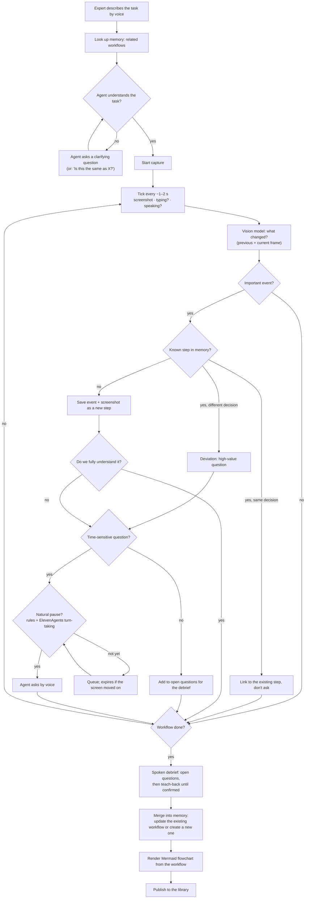

# AGENTS.md

Guide for AI coding agents (and humans) working on **Socrates**, our entry for Hack-Nation's 7th Global AI Hackathon, **Challenge 01: The AI Apprentice** (powered by ElevenLabs).

> **Hackathon rules of thumb:** ship a working demo over a perfect architecture. Keep the app runnable on mock data at all times. Small commits, no big refactors without asking the team.

---

## 1. What we're building

Experts carry judgment that was never written down. Screen recordings show *what* they did, not *why*. Socrates is an **apprentice, not a recorder**: it watches an expert do a real task, asks *why* at natural pauses (by voice), remembers what it already knows, and turns the session into a **Workflow** that a new hire can be guided through later.

The brief requires all three modules. We build them in this order:

| Module      | What                                                                                                   | When                       |
| ----------- | ------------------------------------------------------------------------------------------------------ | -------------------------- |
| **Capture** | Expert shares their screen; frames go to a vision model every ~1–2 s; an ElevenLabs voice agent asks *why* at pauses | 1st: MVP core             |
| **Map**     | Spoken debrief closes the gaps, ends with a teach-back; output is a clickable workflow + flowchart       | 2nd: MVP core              |
| **Teach**   | A new hire picks a workflow and is guided through it by voice on their own screen                      | 3rd: required for judging  |

Running example from the brief: Sabine (accounts payable, 24 years) processes supplier invoices. One is over the €5,000 capex line, one supplier double-bills every December, one needs a second approval because it comes from the Czech subsidiary. Our demo runs on our own **mock ERP** (§3) with this fake data.

### Judging requirements (don't break these)

- **Capture:** during a real task the agent asks **≥ 3 questions**, each at a natural pause and about something **visible on screen**. **At least one is about a guardrail** (a limit, an exception, when to stop and ask someone).
- **Map:** the debrief asks **≥ 3 follow-up questions** not answered during the task and ends with a **teach-back the expert confirms**. Every step and guardrail links to a **screen moment** and the **expert's own words**.
- **Teach:** a new hire processes a case the expert never showed; the tutor **catches at least one wrong decision before it's saved** and explains it using the expert's reasoning.
- **Ask less, later:** 3–5 live questions per 10 minutes. Everything else waits for the debrief.
- **The voice agent is the product.** ElevenAgents plays interviewer and tutor in **Expressive Mode** (Eleven v3 Conversational voice + prosody-aware turn-taking); Scribe v2 Realtime handles listening and pauses.
- The demo must answer: *When to ask? What to ask? When has it understood? Did the new hire learn? Trust (off the record + personal data)?*
- The pitch ends with **one moonshot slide** and how the MVP gets there. Our memory (§5) is the start of the brief's "living company memory".

There is a list of the prompts in `docs/PROMPTS.md`

---

## 2. Glossary (use these words in code and UI)

| Our term                | Meaning                                                                                         | Type in `types.ts`         |
| ----------------------- | ----------------------------------------------------------------------------------------------- | -------------------------- |
| **Session**             | One capture run of one expert doing one task                                                    | `CaptureSession`           |
| **Tick**                | One sample every ~1–2 s: screenshot + activity signals                                          | *(to add, see §4)*         |
| **Event**               | Something that happened in a session (screen change, speech, question, off-record)              | `SessionEvent`             |
| **Important event**     | An event that matters to the workflow; becomes a candidate step, keeps its screenshot           | → `WorkMapStep`            |
| **Workflow**            | The saved, shareable result: steps, decisions, reasons, guardrails, debrief, teach-back         | `WorkMap`                  |
| **Screen moment**       | Screenshot + timestamp a step or quote points to                                                | `ScreenMoment`             |
| **Guardrail**           | `limit` / `stop_and_ask` / `never`                                                              | `Guardrail`                |
| **Open question**       | Something the agent doesn't understand yet; asked live or saved for the debrief                 | `DebriefItem`              |
| **Debrief**             | Questions asked after the task, then the teach-back                                             | `DebriefItem`, `TeachBack` |
| **Memory**              | All confirmed workflows the agent can look up, so it doesn't document the same thing twice      | *(see §5)*                 |
| **Known step**          | A step in the current session that matches a step in a saved workflow                           | *(see §5)*                 |
| **Deviation**           | A known step where the expert decided differently from the saved workflow                       | *(see §5)*                 |

Say **workflow** in UI text, prompts and docs. Code identifiers still use `WorkMap` (`types.ts`, `features/work-maps/`, `/work-maps/` routes).

---

## 3. Architecture

```
┌──────────────────────────┐  events   ┌───────────────────────────────┐
│  Mock ERP (sandbox/)     │ ────────► │  Web app (web/)               │
│  fake invoices, typing   │ ◄──────── │  screen capture, session UI,  │
│  events, save gate       │ allow/hold│  workflows, ElevenLabs widget │
└──────────────────────────┘           └───────┬───────────────┬───────┘
                                               │ REST          │ WebRTC / WS
                                               ▼               ▼
                                 ┌──────────────────────┐  ┌──────────────────────┐
                                 │ Backend (Vercel fns) │  │ ElevenAgents         │
                                 │ vision, LLM, memory, │◄─┤ interviewer / tutor, │
                                 │ redaction, storage   │  │ Scribe v2 Realtime   │
                                 └──────────┬───────────┘  └──────────────────────┘
                                            ▼
                                 Vercel Blob (screenshots)
                                 Postgres (sessions, events, workflows)
```

- **Web app** (`web/`) records the screen with `getDisplayMedia`, runs the session UI, hosts the ElevenLabs voice agent and shows workflows. Hosted on **Vercel** (root directory `web`).
- **ElevenAgents** runs the conversation. The browser connects directly using a **signed URL from our backend** (the API key stays server-side). Screen events go into the conversation as **contextual updates / client tools**, so the agent knows what's on screen. The agent calls our backend through **tools** (e.g. `lookup_memory`, `get_open_questions`, `record_answer`). Its transcript is the source of every `Quote`.
- **Mock ERP** (`sandbox/`, planned) is a small web app with the invoice demo data. Because we control it, it can:
  - send typing / field-change events to the web app (`postMessage`), so **no browser extension is needed for the MVP**;
  - **pause a save** and ask the tutor first. That's how Teach catches a wrong decision *before it's saved*.
- **Backend** = Vercel functions (`web/api/`). It holds every API key and makes every model call. **Never call a model provider from the browser and never put secrets in `VITE_*` env vars**, because those ship to the client.
- **Storage + login:** **Supabase**. Postgres tables hold workflows, sessions and capture status as JSONB (`web/supabase/schema.sql`); screenshots go to the private Storage bucket `frames`. `server/db.ts` syncs the in-memory store with Supabase around each request; `server/auth.ts` checks the Supabase access token. Without `SUPABASE_*` env vars everything runs in memory with no login.
- **The data contract** is [`web/src/lib/api/types.ts`](web/src/lib/api/types.ts). If you change it, update `client.ts`, `http.ts` and `mock/`, and tell the team.
- **Browser extension** (`extension/`) is postponed. Only build it if we need to capture apps we don't control.

---

## 4. Project flow



### Step by step

1. **Task intake (voice).** The expert says what they're about to do. The backend **looks up memory** (§5) for related workflows. The agent asks questions until it can state the goal and trigger in one sentence each (`WorkMap.summary`, `WorkMap.trigger`). If a saved workflow matches, it confirms: *"Looks like invoice processing, which Sabine already showed me. Same workflow?"*
2. **Tick** (every ~1–2 s). Collect one sample:
   ```ts
   // Proposed: add to types.ts when implementing
   interface Tick {
     sessionId: ID
     at: number          // seconds since session start
     screenshot: Blob    // downscaled JPEG/WebP
     typing: boolean     // from the mock ERP (or screen diff)
     speaking: boolean   // from the ElevenLabs conversation / mic VAD
   }
   ```
   - Skip frames that are (nearly) identical to the previous one.
   - **One vision call at a time.** Vision calls (2–5 s) can be slower than the tick. Drop stale frames instead of queueing them; never process results out of order.
3. **Vision model.** Send the **previous and current frame** plus a short context (task, last few events, matched workflow steps). It returns **events, not prose**, e.g. `invoice 4471 opened`, `cost center changed 4711 → 0400`, and flags whether an event is **important**.
4. **Known step?** Compare the important event with the steps of the matched workflow (§5).
   - **Same decision:** link this screen moment to the existing step. Don't create a step, don't ask.
   - **Different decision (deviation):** the most valuable question there is: *"Last time this went to opex, now capex. What's different?"* The answer usually becomes an edge case or guardrail.
   - **Unknown:** save as a new candidate step with its `ScreenMoment`.
5. **Do we understand it?** If the reason is already known (narration, memory, earlier answer, obvious from screen) don't ask. Prefer questions that reveal a **reason** or a **guardrail**, never questions the screen already answers. Otherwise add an **open question** (`DebriefItem`, `resolved: false`, linked to the step).
6. **Time-sensitive?** A question is time-sensitive if it only makes sense while the relevant screen is visible. Otherwise it waits for the debrief.
7. **When to ask.** Hard rules first, then ElevenAgents turn-taking:
   - Don't ask while the expert is typing or speaking, or within ~2 s after.
   - Respect the rate limit (3–5 live questions / 10 min).
   - Queued questions **expire**: if the screen has moved on, demote them to the debrief.
8. **Workflow done?** The expert says so, or the agent proposes it. Then the **spoken debrief**: ask the open questions (≥ 3), then explain the whole process back. Repeat until the expert confirms (`TeachBack.confirmed = true`), recording corrections in their words.
   - **Done means:** every open question is `resolved` **and** the teach-back is confirmed. This is our answer to "when has it understood?".
9. **Merge into memory.** An LLM merges events, transcript and answers into `WorkMap` JSON that matches `types.ts` exactly. If the session matched a saved workflow, produce an **update** (new steps, edge cases, guardrails, plus this `sessionId`), not a duplicate. Validate before saving.
10. **Flowchart.** Generate the Mermaid diagram **deterministically from the `WorkMap` JSON** (steps → nodes, judgment steps → decision diamonds, guardrails → side notes). Don't let the LLM write raw Mermaid; it breaks syntax too easily.
11. **Publish.** Save to the backend; it appears in the library (`/`).

### Teach (3rd)

A new hire picks a workflow and works a case in the mock ERP. The tutor (same ElevenAgents setup, tutor prompt, workflow from memory) watches the screen the same way, explains each step in the expert's words and asks them to predict the next decision. When they're about to break a guardrail, the mock ERP **holds the save** and the tutor steps in: *"Sabine would stop here. Why do you think?"*, replaying her screen moment. At the end: what they mastered, what to practice.

---

## 5. Memory: don't document the same workflow twice

The agent must know which workflows already exist, so it skips what's documented and asks only about what's new.

**What memory holds:** confirmed workflows: steps, decisions, reasons, guardrails, edge cases and resolved debrief answers.

**When it's used:**

| Moment        | What happens                                                                                         |
| ------------- | ---------------------------------------------------------------------------------------------------- |
| Task intake   | Find related workflows for the task description; the expert confirms the match (or says it's new)    |
| Each event    | Match against the matched workflow's steps → known / deviation / new                                  |
| Question pick | Never ask something memory already answers (reason, guardrail, debrief answer)                       |
| End of session| Update the matched workflow instead of creating a duplicate; otherwise create a new one              |
| Teach         | The tutor loads the workflow it teaches from memory                                                  |

**Implementation (MVP):**

- **Lookup:** we'll have few workflows, so start simple. Pass all `WorkMapSummary`s to an LLM and let it pick. Switch to embeddings (e.g. pgvector) only if the list grows.
- **Step matching:** give the vision/event prompt the matched workflow's steps (title + decision) and let it return `matchedStepId` and `sameDecision` with each important event.
- **Agent access:** expose memory to ElevenAgents as server tools (`lookup_memory(task)`, `get_work_map(id)`), so the voice agent can say *"I already know this part"* and skip ahead.
- **Contract changes (proposed, add to `types.ts` + `SocratesApi`):**
  ```ts
  findRelatedWorkMaps(task: string): Promise<WorkMapSummary[]>
  // On SessionEvent / candidate steps:
  matchedStepId?: ID      // links to a step in an existing workflow
  deviation?: boolean     // expert decided differently than the saved step
  // On CaptureSession:
  basedOnWorkMapId?: ID   // the workflow this session extends
  ```
- Only **confirmed** workflows count as memory. Drafts don't, so a half-understood session can't stop the agent from asking.

---

## 6. Trust & privacy

- **Off the record:** the expert can flip the switch **or say it** ("take that off the record"). While it's on: send no frames, store nothing, ask nothing. Log only an `off_record` event with the time span.
- **Redact server-side** (e.g. Microsoft Presidio) before screenshots are stored or shown. `ScreenMomentView` draws `redactions` boxes as a second line of defence only, because the raw image is still downloadable.
- Demo with **fake or sandbox data only**. Never commit real screenshots, transcripts or API keys.

---

## 7. Development: record once, replay many times

Doing the task live for every prompt tweak is slow. Build a **replay mode** early:

- Save a session's raw ticks (screenshots + signals) and audio/transcript to storage.
- A replay runs the same pipeline from the saved ticks, at real speed or faster.
- Use it to tune prompts, to test memory (replay a session against an existing workflow), and as a **backup if the live demo fails**.

---

## 8. Stack & commands

**Web:** React 19 · TypeScript · Vite · Tailwind v4 · shadcn/ui (Radix) · React Router · TanStack Query · `@elevenlabs/react` · hosted on Vercel.

All commands run from `web/`:

```bash
npm install
npm run dev          # http://localhost:5173, runs on mock data
npm run typecheck    # tsc -b
npm run lint         # ESLint
npm run format       # Prettier (no semicolons, width 100, Tailwind class order)
npm run build        # typecheck + production build
```

**Before you commit:** `npm run typecheck && npm run lint && npm run format`.

---

## 9. Git workflow

Several people work on this repo at the same time, so **every new feature or fix goes on its own branch**. Never commit or push directly to `main`.

1. **Start from an up-to-date `main`:** `git switch main && git pull`, then `git switch -c <type>/<short-name>`.
   - Types: `feat/`, `fix/`, `docs/`, `chore/`. Examples: `feat/memory-lookup`, `feat/mock-erp`, `fix/tick-throttle`.
2. **Keep branches small and short-lived.** One feature per branch; merge within hours, not days.
3. **Stay in sync:** merge `main` into your branch regularly (`git merge origin/main`) and before opening a PR.
4. **Open a pull request into `main`.** Say what changed and how to test it. Vercel builds a preview deployment for every branch; link it in the PR.
5. **Contract changes** (`web/src/lib/api/types.ts`) must be called out in the PR title or description and announced to the team, because they affect everyone.
6. **Merge only when** typecheck, lint and build pass and the app still runs on mock data.

AI agents: if you're on `main` when starting a task, create a branch first. Don't push or open PRs unless asked.

---

## 10. Code conventions

See [`web/README.md`](web/README.md) for the full structure and recipes. The essentials:

- **Feature folders.** `src/features/<name>/` owns its pages, components and `hooks.ts`. Features may import from `lib/`, `components/` and `app/paths`, **not from each other** (the only exception: `AskPanel` is reused on the workflow page). New areas (`session/`, `debrief/`, `voice/`, `teach/`) get their own folder.
- **Data access** goes through the `SocratesApi` interface (`lib/api/client.ts`) and React Query hooks. To add a call: add it to `SocratesApi`, implement it in **both** `http.ts` and `mock/index.ts`, then wrap it in a hook.
- **Mocks stay working.** Without `VITE_API_URL` the app uses `mockApi`. Every new feature needs mock data so others can work without the backend.
- **Routes:** add the page in `app/router.tsx`, the path in `app/paths.ts`, the nav item in `app/app-layout.tsx`. Build links with `paths.*`, never hand-written URLs.
- **shadcn:** add components with `npx shadcn@latest add <component>`. Don't hand-edit `components/ui/` beyond small tweaks.
- **Imports** use the `@/` alias for `src/`.
- **Timestamps:** `at` = seconds since session start; wall-clock = ISO 8601. Rects are normalized to `0..1`.
- **LLM output** must match `types.ts`. Validate it at the boundary (e.g. with zod) instead of trusting it.
- **Prompts** live in their own files (one per prompt, e.g. `prompts/vision-events.md`, `prompts/interviewer.md`, `prompts/tutor.md`, `prompts/memory-match.md`) so we can iterate on them without touching code.
- **UI** follows [`docs/brand-guidelines.md`](docs/brand-guidelines.md) (fonts, colors, shadcn token mapping).
- Keep components small and readable. Comment the *why*, not the *what*.

---

## 11. Out of scope for the MVP

- Browser extension (only if we need apps we don't control)
- Detecting "listening to someone" from system/tab audio (fragile across browsers)
- Auth, multi-tenant accounts, billing
- Stretch goals: two experts on one task (deviations in §5 are a first step), cross-language teaching, exporting workflows as agent instructions
